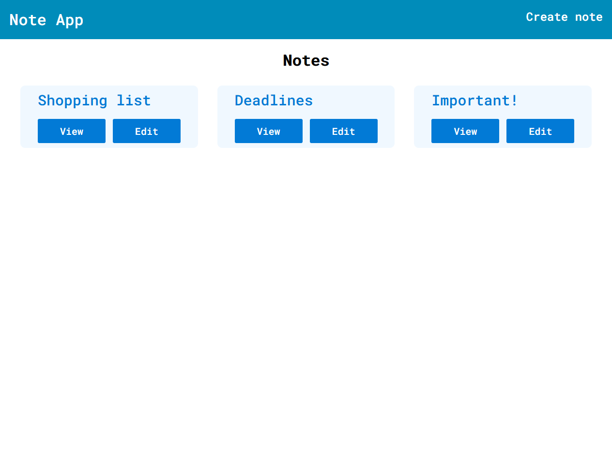
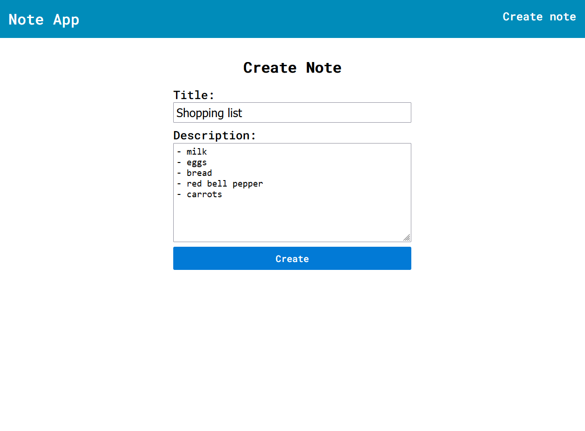
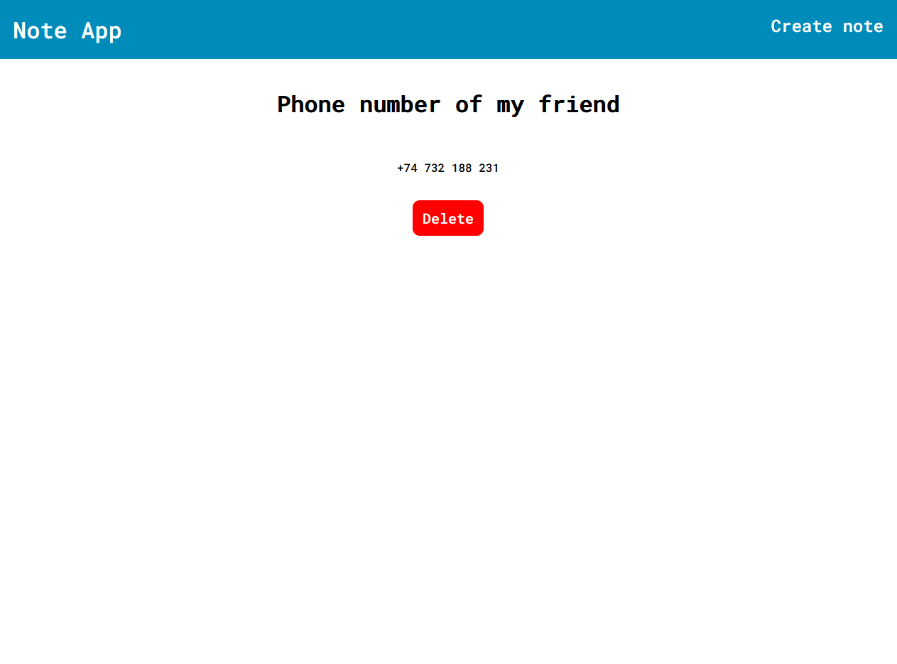
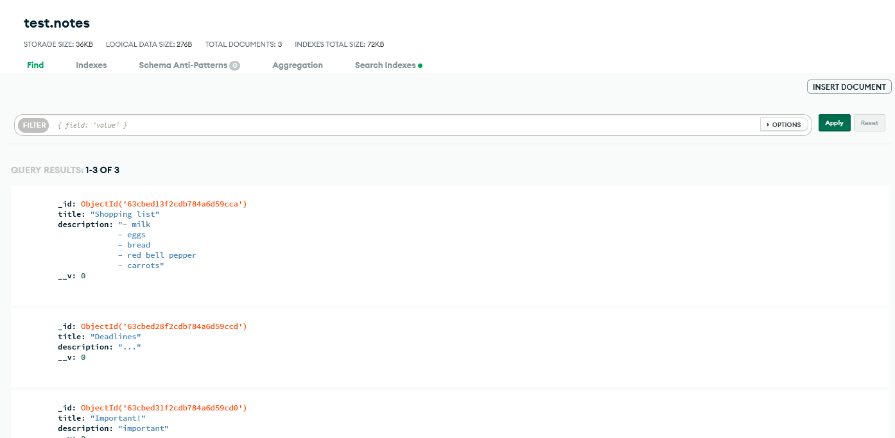

# Note application

## Description
Application created with Next.js and MongoDB. Built in educational purposes (how to store and fetch data from the MongoDB database). I used ESLine tool to analyze and improve my code with AirBnb code style rules.

Allows user to create, edit, view and delete notes.

## Overview

### Homepage of the application

### Create new section of the application

### View note section of the application

### Data stored in MongoDB database

## Available scripts

In the project directory you can run:

### `npm run dev`

Builds the app for production to the `notes-app` folder.\
It correctly bundles React in production mode and optimizes the build for the best performance.